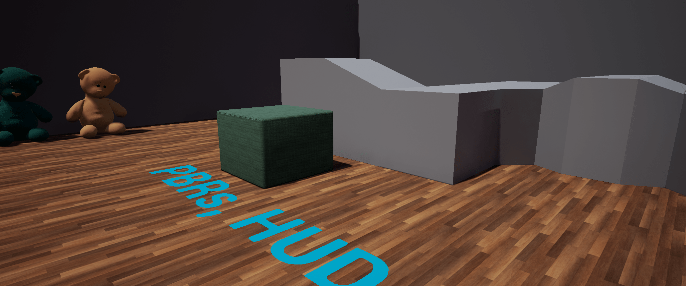

# Project Name MDEVPBRs

A project to demonstrate PBRs, HUD, and Blueprints interactive menu.

Physics Based Rendered materials on teddy bear, floor and knit cube,

HUD based on Unreal Onlne learning course "Interactive Material Swaps Using Blueprints"  
https://learn.unrealengine.com/course/2436526/

## Usage

Clone, or download the zip, to your local UE projects directory.
Open with UE 4.25 or newer.
The application packages, installs, and runs on Android and IOS devices however the onscreen buttons are small.

